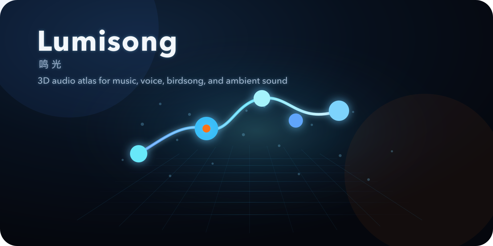
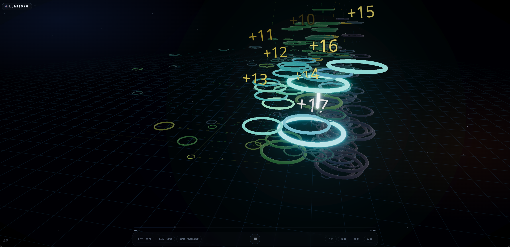
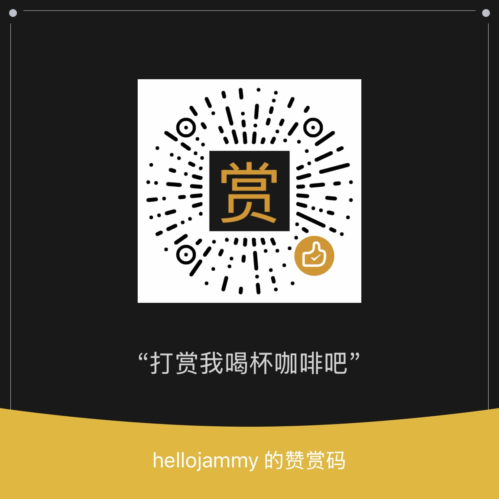

<p align="center">
  
</p>

# Lumisong

> Lumisong is a 3D audio visualization project for personal learning, research, and non-commercial creative use.

中文版：[README.md](README.md)  
Technical Whitepaper: [中文](docs/TECHNICAL_WHITEPAPER.md) / [English](docs/TECHNICAL_WHITEPAPER.en.md)

## Usage Limits

- This project is for non-commercial use only. Without explicit permission from the author, it must not be used in commercial products, paid services, SaaS, commercial performances, advertising, enterprise commercial workflows, or other revenue-oriented scenarios.
- Lumisong includes audio analysis, WebGL/Three.js visualization, and a desktop shell. Analysis results are for visual expression only and should not be used for medical, legal, copyright, forensic, acoustic-measurement, or other serious decisions.
- Users are responsible for copyright and authorization of any uploaded, recorded, or demonstrated audio material.

Full license terms: [LICENSE](LICENSE) (PolyForm Noncommercial License 1.0.0).

## Introduction

Lumisong turns music, voice, birdsong, and ambient sound into a playable 3D audio atlas. Each node represents an analyzed audio event. Its position, size, color, form, connections, light trails, and camera motion together reveal the structure of the source audio.

It is not merely a player and not a birdsong-only analyzer. More precisely, Lumisong is an experimental application that translates sound into a spatial visual experience: upload a song, a voice recording, or an ambient sound, and observe its rhythm, energy, and movement as a 3D structure.

## Preview

<p align="center">
  
</p>

https://github.com/user-attachments/assets/bc84fc56-34c7-4f7a-b8c7-04514658aecf

## Features

**Audio analysis**

Lumisong supports local audio uploads including music, voice, birdsong, and ambient sound. After upload, it performs an initial audio-profile guess, then lets the user confirm or change the profile before formal analysis.

**3D audio atlas**

The analysis result becomes a playable set of 3D audio events. Time, timbre-related features, energy, tonality, color, size, connections, and trails work together to turn audio into a spatial object that can be watched and compared.

**Forms and palettes**

The same data can be rendered through several geometric forms: Glass Orb, Light Spire, Ripple, Gem, and Planet. The default palette is Magma, with Ice, Viridis, and Amber also available.

**Camera and playback**

Main camera modes include Adaptive Camera, Uniform Orbit, Free Camera, and Flight Pilot, with Ship Cruise and Breathing Orbit available under more options. Adaptive Camera follows playback progress, active audio events, and the global point-cloud distribution to produce an automatic viewing path.

**Interaction and desktop app**

Playback supports play, pause, seeking, fullscreen, refresh, labels, mist, combo popups, finale fade, and breathing glow. Recording and recording playback are also supported. The macOS app is packaged from the same Web build.

## Quick Start

The recommended way to try Lumisong is the macOS app.

- Download: [release/Lumisong-0.1.0-macos-arm64.dmg](release/Lumisong-0.1.0-macos-arm64.dmg)
- Requirements: macOS 13+, Apple silicon

Install:

1. Download the DMG.
2. Open it and drag `Lumisong.app` to Applications.
3. If macOS says the developer cannot be verified, right-click `Lumisong.app`, choose Open, then confirm.
4. You can also go to System Settings -> Privacy & Security, find the blocked Lumisong entry, and choose Open Anyway.
5. If macOS reports that the app is damaged or cannot be opened, remove the quarantine attribute:

```bash
xattr -rd com.apple.quarantine /Applications/Lumisong.app
```

If it still cannot be opened, clear all extended attributes:

```bash
xattr -cr /Applications/Lumisong.app
```

## Development

Requirements: Node.js 20+ and npm. macOS app packaging requires macOS and the Swift toolchain.

```bash
cd web
npm install
npm run dev
npm test
npm run build
```

Common commands:

- `npm run dev`: local development server.
- `npm run dev:host`: expose the dev server to LAN devices.
- `npm test`: run tests.
- `npm run build`: build Web assets into `web/dist/`.

```bash
# repository root
./macos/build-app.sh
./macos/package-dmg.sh
```

macOS build outputs are `macos/build/Lumisong.app` and `macos/build/Lumisong-0.1.0-macos-arm64.dmg`. Release DMGs are placed under `release/`.

## Project Structure

```text
.
├── web/                 # Main Web app, Vite + TypeScript + Three.js
├── macos/               # macOS app shell and packaging scripts
├── ios/                 # iOS app shell, still under debugging
├── backend/             # Offline preprocessing script
├── release/             # Current macOS DMG release
├── web/public/brand/    # Logo, README banner, icons, brand assets
└── BRAND.md             # Brand asset usage guide
```

## Acknowledgements

- Lucio Arese's [Seeing Birdsong](https://www.lucioarese.net/portfolio_page/visual-birds/) provided important inspiration for the high-level visual idea: organizing audio events into a watchable 3D spatial atlas and revealing sound structure through light, paths, and camera motion. Lumisong is an independent implementation for music, voice, birdsong, and ambient sound, with no affiliation to the original author or project.
- [Three.js](https://threejs.org/): 3D rendering foundation.
- [Essentia.js](https://mtg.github.io/essentia.js/): browser-side audio feature extraction.

## Buy the Author a Coffee

If Lumisong is useful or interesting to you, you can support future maintenance by buying the author a coffee.

<p align="center">
  
</p>

## Brand Assets

Logo, icons, and README banner guidelines are documented in [BRAND.md](BRAND.md). Future icon or logo updates should use the finalized assets under `web/public/brand/` as the source of truth.

